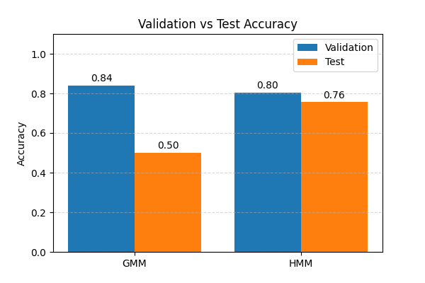
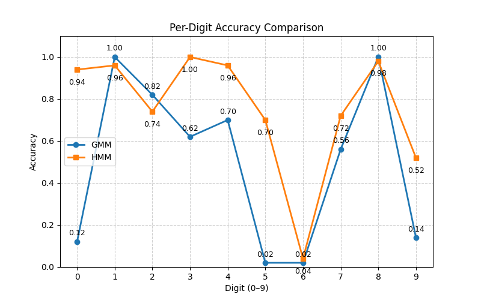
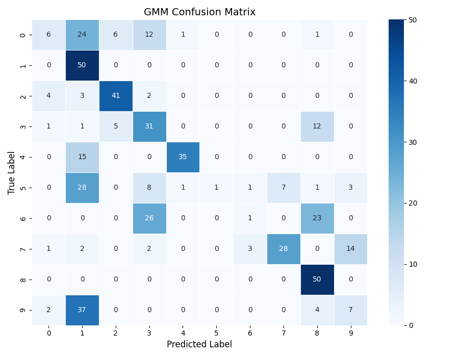
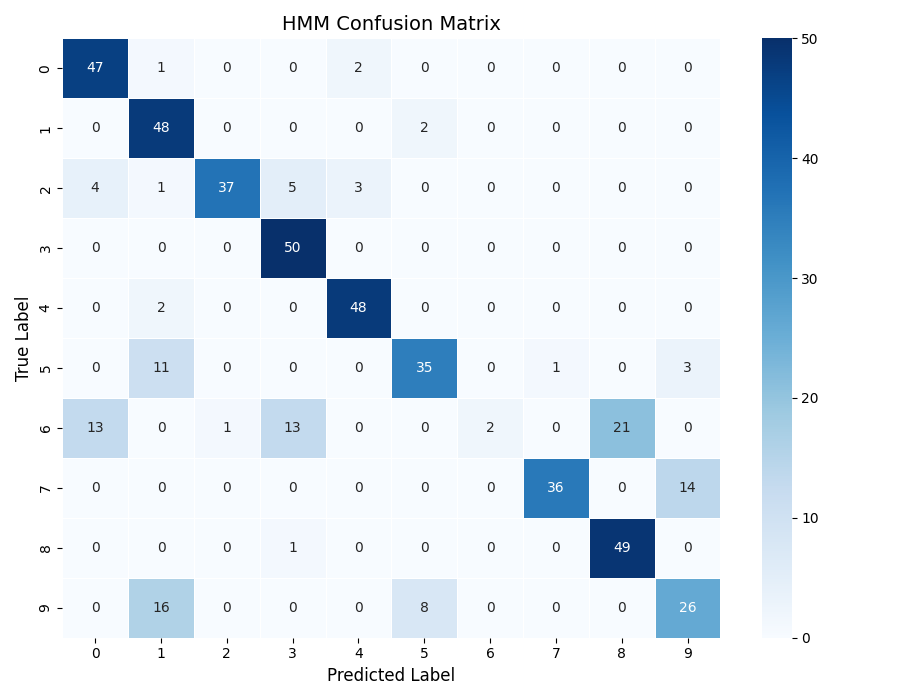
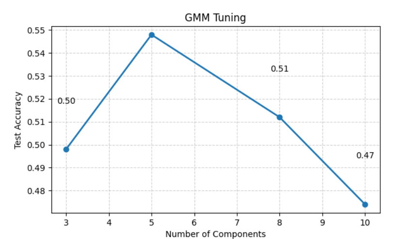
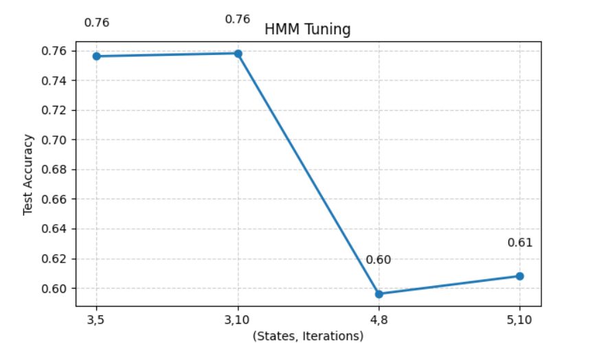

# Spoken Digit Recognition using GMM and HMM

## Overview

This project implements a spoken digit recognition system for digits 0–9 using MFCC audio features and probabilistic machine learning models implemented from scratch.

The objective is to train on recordings from speakers 1–5 and evaluate performance on an unseen speaker (speaker 6), testing the model's ability to generalize.

Two approaches were implemented:

* Gaussian Mixture Model (GMM)
* Hidden Markov Model (HMM)

## Feature Extraction

Audio recordings are converted into 13-dimensional MFCC (Mel-Frequency Cepstral Coefficient) feature vectors using Librosa.

MFCCs capture the spectral characteristics of speech and provide a compact representation suitable for speech recognition tasks.

## Models

### Gaussian Mixture Model (GMM)

* Implemented from scratch using the Expectation-Maximization (EM) algorithm.
* Models the distribution of MFCC features for each digit.
* Assumes frames are independent.

### Hidden Markov Model (HMM)

* Implemented from scratch using Baum-Welch training.
* Models temporal transitions between hidden states.
* Captures sequential patterns in speech.

## Results

| Model | Validation Accuracy | Test Accuracy |
| ----- | ------------------- | ------------- |
| GMM   | 0.84                | 0.50          |
| HMM   | 0.804               | 0.756         |

## Key Insights

* GMM achieved higher validation accuracy but significantly lower test accuracy, indicating overfitting.
* HMM generalized much better to unseen speakers.
* Temporal modeling is crucial for speech recognition tasks.
* Digit 6 remained challenging for both models due to acoustic similarity with other digits.

## Visual Results

## Accuracy Comparison



## Per-Digit Accuracy



## GMM Confusion Matrix



## HMM Confusion Matrix



## GMM Hyperparameter Tuning



## HMM Hyperparameter Tuning



## Installation

```bash
pip install -r requirements.txt
```

## Training and Evaluation

```bash
python train_test.py
```

## Inference

```bash
python inference.py
```

## Dataset

The dataset used for this project is not included in the repository.

To run the project:

1. Place the audio recordings in a local folder.
2. Update the `data_path` variable in `train_test.py` and `inference.py`.
3. Install dependencies using:

```bash
pip install -r requirements.txt
```

4. Run:

```bash
python train_test.py
python inference.py
```

## Repository Structure

```text
src/        -> model implementations
results/    -> generated plots
train_test.py
inference.py
Report.pdf
```
